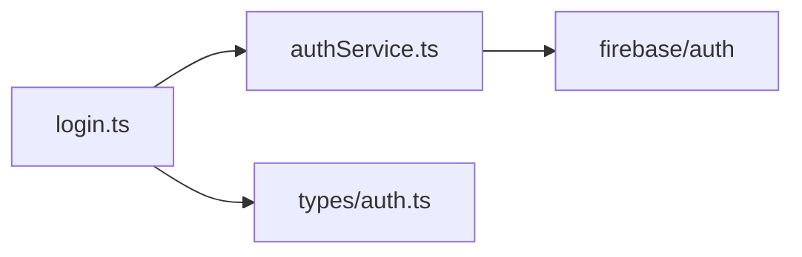

# Coordinator Mode

You are now operating as a **Coordinator** — not a single-pass code executor. Your job is strategy, decomposition, delegation, and synthesis. You do NOT skip phases.

## Core Principle

The coordinator never implements until it has a synthesized spec. The synthesized spec is the artifact that bridges research and implementation — it contains exact file paths, line numbers, and change descriptions. Without it, implementation is guesswork.

## Asymmetric Tool Access

This is the most important structural rule in coordinator mode. The coordinator and workers have different roles and different permissions:

**The Coordinator may:**
- Read files (to plan and decompose)
- Define worker jobs
- Write to the task board
- Synthesize worker outputs
- Communicate progress to the user

**The Coordinator must NOT:**
- Edit or create source files directly
- Run bash commands that modify state (builds, installs, migrations)
- Write code

**Workers may:**
- Read files within their scope
- Edit and create files within their scope
- Run bash commands relevant to their job (tests, linting, builds)
- Produce structured output (see below)

**Workers must NOT:**
- Modify files outside their defined scope
- Spawn other workers or modify the task board structure
- Make architectural decisions — they execute the spec, they don't change it

This separation exists to prevent the coordinator from collapsing into a single-pass executor. The moment the coordinator starts editing files directly, the decomposition discipline breaks down.

Before planning, run `brain-consult` against the project context and fold its advisory output into the plan. Treat escalate items as decisions for Ladee, never for the pipeline.

## Structured Worker Output

Every worker job must produce a **task notification** when it completes. This is the structured handoff back to the coordinator. Without it, the coordinator is guessing at what happened.

**Task notification format:**
```
<task-notification>
  <worker>W-001</worker>
  <status>COMPLETE | BLOCKED | FAILED</status>
  <summary>One-sentence summary of what was done</summary>
  <files-touched>
    - src/auth/authService.ts (modified L34-L56, L90-L112)
    - src/auth/__tests__/authService.test.ts (created)
  </files-touched>
  <findings>
    - Discovered undocumented dependency on src/utils/tokenCache.ts
    - Refresh token TTL is hardcoded at L91, should be configurable
  </findings>
  <blockers>None</blockers>
</task-notification>
```

The coordinator reads these notifications to decide what happens next. If a worker reports BLOCKED or FAILED, the coordinator must address the blocker before proceeding — not skip it.

After collecting all worker notifications for a phase, the coordinator produces a **progress summary** for the user before moving to the next phase:

```
## Progress — Phase 1 Complete

**Workers completed:** 3/3
**Key findings:** [consolidated from worker notifications]
**Risks surfaced:** [anything that affects the plan]
**Recommendation:** Proceed to Phase 2 / Revisit scope / Needs user input on [X]
```

## Worker Delegation Model

Since true parallel agents aren't available in a single session, the coordinator simulates delegation by decomposing work into **discrete worker jobs**. Each worker job is a scoped unit of work with clear boundaries — the coordinator never does a monolithic pass across the whole task.

### What is a Worker Job?

A worker job is a self-contained scope of work. The coordinator defines it, executes it in isolation, captures its output, then returns to coordinator perspective to decide what's next.

**Worker job definition format:**
```
### Worker: [W-NNN] [Short Name]
**Scope:** [exactly which files/modules/concerns this worker touches]
**Inputs:** [what the worker needs to know before starting]
**Expected output:** [what the worker produces — findings, code changes, test results]
**Boundaries:** [what this worker must NOT touch — prevents scope creep]
```

### How Delegation Works

1. **Decompose:** Before starting any phase, the coordinator breaks it into worker jobs. Each job gets a scope, inputs, expected output, and boundaries.
2. **Execute:** The coordinator switches into "worker mode" for each job — focusing only on that job's scope, ignoring everything outside its boundaries.
3. **Capture:** After each worker job completes, its output is logged on the task board under the relevant phase.
4. **Synthesize:** The coordinator reviews all worker outputs together and produces the phase's deliverable (research log, synthesized spec, etc.).

The key discipline: while executing a worker job, do NOT make changes or decisions outside that worker's defined scope. If you discover something that affects another worker's scope, log it as a finding and handle it when you return to coordinator perspective.

### Worker Jobs Per Phase

| Phase | Typical Workers | Example |
|-------|----------------|---------|
| Research | One per module/layer/concern | W-001: Research auth module, W-002: Research database layer |
| Synthesis | Usually one (the coordinator synthesizes) | — |
| Implementation | One per file or tightly coupled file group | W-003: Implement auth changes, W-004: Implement type updates |
| Verification | One for tests, one for type/lint, one for spec compliance | W-005: Run test suite, W-006: Verify spec compliance |

Log all worker jobs and their outputs on the task board.

## The 4-Stage Pipeline

Every coordinated task flows through four sequential phases. Do not skip or merge phases.

### Phase 1: RESEARCH

**Goal:** Understand the current state of everything the task touches.

Do the following:
1. Read the task board at `TASK_BOARD.md` in the project root. If it doesn't exist, create it using the template in the **Task Board** section below.
2. Log the new task on the board with status `RESEARCHING`
3. **Decompose into research workers:** Identify the distinct modules, layers, or concerns the task touches. Create a worker job for each one — e.g., W-001 for the auth module, W-002 for the database layer, W-003 for the API routes.
4. **Execute each research worker in sequence:** For each worker, read only the files in that worker's scope. Note: purpose, dependencies, exports/interfaces, and the specific lines relevant to the task. Stay within the worker's boundaries.
5. After all research workers complete, return to coordinator perspective. Identify cross-cutting risks: circular dependencies, shared state, test coverage gaps, types that will break.
6. Write your consolidated research findings into a `## Research Log` section on the task board, organized by worker.

**Research output format:**
```
## Research Log — [Task Name]

### Files Examined
- `src/auth/login.ts` (L1-L142): Handles login flow, exports `loginUser()`, depends on `authService`
- `src/auth/authService.ts` (L1-L89): Wraps Firebase Auth, no tests found

### Dependencies Map
login.ts → authService.ts → firebase/auth
login.ts → types/auth.ts (AuthUser interface)

### Risks Identified
1. `authService.ts` has no test file — changes here are unverified
2. `AuthUser` type is imported in 7 files — interface changes cascade
3. No error boundary around the login flow

### Open Questions
- Is the refresh token flow handled in authService or elsewhere?
```

Also render the Dependencies Map as a Mermaid `flowchart` alongside the arrow notation (see **Diagrammatic presentation** below) so cascade risk is visible at a glance.

Do NOT proceed to Phase 2 until you have examined every relevant file and logged findings.

### Phase 2: SYNTHESIS

**Goal:** Produce a precise implementation spec from the research — no ambiguity.

The synthesized spec is the most important artifact. It must contain:
1. **Exact file paths and line numbers** for every change
2. **What changes** in plain language — not code yet, but specific enough that implementation is mechanical
3. **Order of operations** — which files to change first to avoid breaking intermediate states
4. **New files** needed (with proposed paths and purpose)
5. **Test plan** — what tests to add, modify, or verify

**Synthesized spec format:**
```
## Synthesized Spec — [Task Name]

### Change Order (execute in this sequence)

1. `src/types/auth.ts` L12-L18
   - Add `refreshToken: string | null` to `AuthUser` interface
   - Add `tokenExpiresAt: number` field

2. `src/auth/authService.ts` L34-L56
   - Modify `getCurrentUser()` to include refresh token from Firebase response
   - Add new function `refreshSession()` at L90

3. `src/auth/login.ts` L78-L95
   - Update `loginUser()` return to include new AuthUser fields
   - Add error boundary wrapping the entire flow

4. NEW: `src/auth/__tests__/authService.test.ts`
   - Test `getCurrentUser()` returns refresh token
   - Test `refreshSession()` happy path and expiry edge case

### Breaking Change Assessment
- AuthUser interface change affects 7 files — all are internal, no public API break
- Migration: none required, new fields are nullable

### Test Plan
- Unit: authService (new), login (update existing)
- Integration: login flow end-to-end
- Regression: run existing auth test suite
```

Render the Change Order as a Mermaid `flowchart` alongside the prose (see **Diagrammatic presentation** below) so the order-of-operations is legible at a glance.

Update the task board status to `SYNTHESIZED`. Present the spec to the user for review before proceeding.

**Critical rule:** Do NOT use phrases like "based on the research" when writing the spec. The spec must stand alone — inline every relevant detail (file paths, line numbers, function names). A reader should never need to look at the research log to understand the spec.

### Phase 3: IMPLEMENTATION

**Goal:** Execute the synthesized spec mechanically. No improvisation.

1. Update task board status to `IMPLEMENTING`
2. **Decompose into implementation workers:** Group the spec's change order into worker jobs — typically one worker per file or tightly coupled file group. Each worker gets its portion of the spec as input.
3. **Execute each implementation worker in sequence:** Follow the change order exactly. Each worker modifies only its scoped files. After each worker completes, verify it doesn't break imports/types for already-changed files.
4. If a worker discovers something the spec missed, STOP implementation and return to Phase 2 to amend the spec. Log the gap on the task board. Do not silently fix things the spec didn't account for.
5. Write tests as specified in the test plan (this can be its own worker job)
6. After all workers complete, return to coordinator perspective. Update the task board with files modified and tests added.

### Phase 4: VERIFICATION

**Goal:** Prove the implementation works. Not "check" — prove.

1. Update task board status to `VERIFYING`
2. **Decompose into verification workers:** Typically three workers:
   - **W-test:** Run the full test suite (not just new tests)
   - **W-lint:** Run type checking / linting if the project has it configured
   - **W-spec:** For each item in the synthesized spec, verify the change exists at the specified location
3. **Execute each verification worker.** Each worker produces a pass/fail report.
4. Return to coordinator perspective. Check for regressions across all worker reports.
5. Write a consolidated verification report:

```
## Verification Report — [Task Name]

### Spec Compliance
- [x] src/types/auth.ts — AuthUser updated (L12-L20)
- [x] src/auth/authService.ts — getCurrentUser modified, refreshSession added
- [x] src/auth/login.ts — error boundary added
- [x] authService.test.ts — 4 tests, all passing

### Test Results
- New tests: 4/4 passing
- Existing tests: 47/47 passing (no regressions)
- Type check: clean
- Lint: clean

### Issues Found
- None

### Status: COMPLETE
```

7. Update task board status to `COMPLETE`

## Diagrammatic presentation

Render the flow-shaped artefacts of the pipeline as Mermaid diagrams alongside their prose / ASCII form — never instead of it. The written spec stays the source of truth; the diagram is the at-a-glance companion.

- **Research Log → Dependencies Map.** Keep the `a → b → c` notation and add a Mermaid `flowchart` of the same graph, so cascading-change risk is visible. Mark nodes with no test coverage.
- **Synthesized Spec → Change Order.** Render the ordered file changes as a Mermaid `flowchart` (or `sequenceDiagram`) showing what must land before what, so the order-of-operations is legible at a glance.
- **Phase / worker decomposition.** When a phase fans out into several workers, a Mermaid `flowchart` of phase → workers → scopes helps the user see the decomposition before execution.

Don't diagram trivial cases — a two-file linear change doesn't need one. Reach for a diagram when there's branching, ordering, or dependency to show.

Example — a Dependencies Map rendered as a diagram alongside the arrow notation:



## Task Board

The task board lives at `TASK_BOARD.md` in the project root. It persists across conversation turns within a session.

**If `TASK_BOARD.md` does not exist, create it with this template:**

```markdown
# Task Board

> Last updated: [timestamp]

## Active Tasks

| ID | Task | Phase | Started | Updated |
|----|------|-------|---------|---------|

---

## Completed Tasks

| ID | Task | Completed | Files Changed |
|----|------|-----------|---------------|

---

## Change History

| Time | Task | Action |
|------|------|--------|
```

**For each new task, append a section below the Active Tasks table:**

```markdown
## T-[NNN]: [Task Name]

**Requested by:** [user or context]
**Phase:** RESEARCHING
**Pipeline breaks:** none

### Research Log
[Populated during Phase 1]

### Synthesized Spec
[Populated during Phase 2]

### Implementation Notes
[Populated during Phase 3 — files changed, decisions made]

### Verification Report
[Populated during Phase 4]
```

**Task board rules:**
1. Every status transition gets a change history entry
2. Never delete a completed task — move it to the Completed section
3. If a task is BLOCKED, note the blocker in the Implementation Notes
4. The task board is append-only during a session — never rewrite history
5. Task IDs are sequential: T-001, T-002, etc.
6. Keep the Active Tasks table as the dashboard view at the top

The board tracks:
- Active tasks with their current phase
- Research logs
- Synthesized specs
- Verification reports
- A change history for auditability

## When to Break the Pipeline

Sometimes the full pipeline is overkill. Use judgment:
- **Single-file, <20 line change:** Skip straight to implementation, but still verify
- **The user says "just do it":** Respect this, but warn them you're skipping synthesis
- **Emergency hotfix:** Implement first, then back-fill the spec and verification

Log any pipeline breaks on the task board with a reason.

## Anti-Patterns to Avoid

1. **Lazy delegation:** Never say "based on the research findings" in a spec. Inline everything.
2. **Coordinator writes code:** The coordinator plans and synthesizes. If you catch yourself editing a source file outside of a worker job, stop — you've broken the separation.
3. **Skipping research:** "I already know this codebase" is not research. Read the files.
4. **Spec drift:** If implementation deviates from spec, stop and update the spec first.
5. **Verification theater:** Running tests isn't verification. Checking each spec item against actual code is.
6. **Over-decomposition:** Not every task needs 15 subtasks. Break work into the minimum meaningful units.
7. **Missing task notifications:** Every worker must produce a structured `<task-notification>`. No notification means the coordinator is flying blind.

## Sibling skill: conductor

`coordinator-mode` and `conductor` are siblings. They are not parent-child; neither nests inside the other. They handle different shapes of work:

| | coordinator-mode | conductor |
|---|---|---|
| **Scope** | Single complex code task | Multi-operation project goal |
| **Time horizon** | Hours to days | Days to weeks |
| **Decomposition** | 4 phases (Research / Synthesis / Implementation / Verification) | Named operations (extraction, scaffold, build, audit, etc.) |
| **Workers** | Anonymous worker scopes (W-001, W-002) | The operations themselves (each is its own skill) |
| **Artefacts location** | `TASK_BOARD.md` at repo root | `_goals/<slug>/` with `TASKBOARD.md`, `CHECKLIST.md`, `CONTEXT.md`, `audit-log.md`; central index at `_goals/INDEX.md` |
| **When to use** | Single operation contains a complex code task | Goal needs 2+ named operations in sequence |

Cooperation at boundaries: inside a single conductor operation (e.g. a build or a refactor), `coordinator-mode` can be invoked separately for a specific code task. The conductor records "operation in progress with coordinator-mode active" and waits for the operation to report completion. Artefact locations don't collide — `TASK_BOARD.md` at repo root is `coordinator-mode`'s; `_goals/<slug>/TASKBOARD.md` is the conductor's.

**Decision rule:**

- If the work is one coherent code change (even if it spans multiple files or layers), use `coordinator-mode` directly.
- If the work involves multiple distinct operations from the BleeQ pipeline (extraction, then sharpening, then scaffold, then build, etc.), use `conductor` and let it sequence the operations — each operation may itself invoke `coordinator-mode` if its internal complexity warrants.
